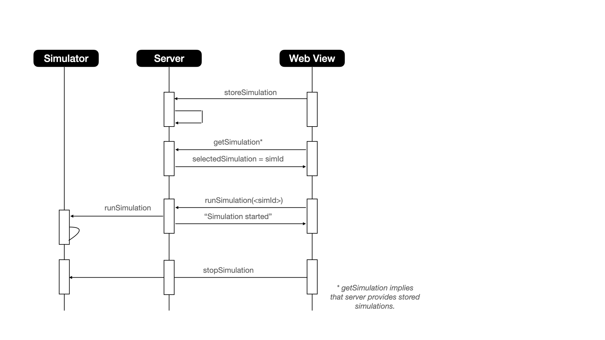

# vru-simulation

VRU SIMULATION SERVER AND WEB VIEW. 
Skeleton Go, HTML + Javascript with open street map ...

Install Golang on your computer https://golang.org/ 
  
```  
 To run locally, build and run server.
 Enter localhost:8081 in your browser
```


**Simple sequence**


